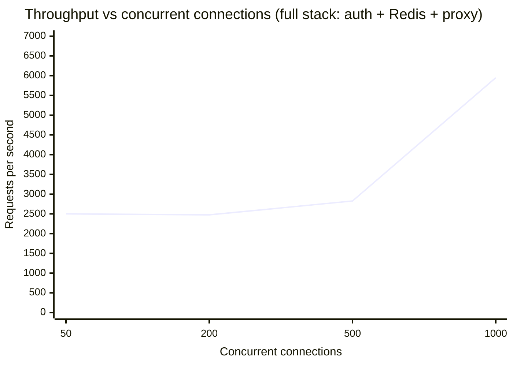
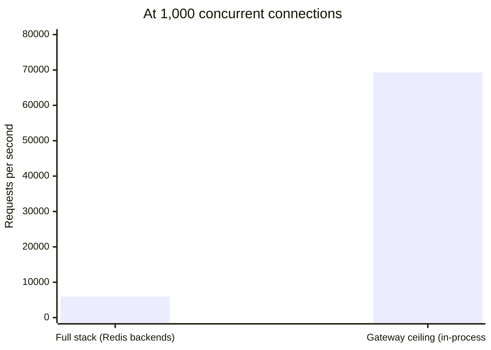
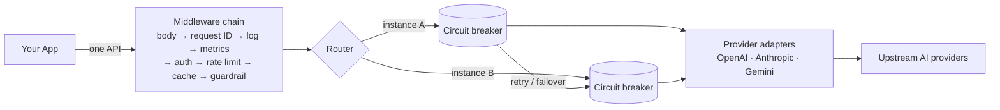
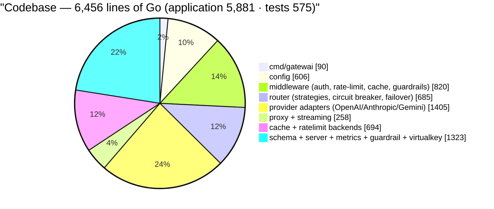

# Gatewai — AI API Gateway

A production-grade reverse proxy that puts a **single OpenAI-compatible API** in front of every AI provider, and handles the hard parts behind it: routing, failover, circuit breaking, rate limiting, caching, cost tracking, content safety, and observability.

> **10K–70K req/s | 0.2–1ms added latency | ~6.5K lines of Go | 50–150MB RAM | 1–2% CPU under burst load**
> — all numbers measured, methodology at the bottom.

---

## Why it exists

Every AI-powered application eventually hits the same wall: OpenAI wants one API shape, Anthropic another, Gemini another still — and each one rate-limits, fails over, and prices differently. Teams either vendor-lock or build a bespoke integration layer per provider.

Gatewai is that layer, built properly: your app changes **one line** (the base URL) and gets routing, failover, caching, governance, guardrails, and observability for every provider — without the usual "let's wrap it in Flask later" architecture debt.

---

## Performance (measured, not estimated)

### Throughput scaling — full stack under load

Every request exercises the entire hot path: auth → Redis rate-limit → Redis cache → router → upstream → response.



### At peak concurrency — full stack vs. gateway ceiling



### Hot-path microbenchmarks

| Hot path | Latency | Allocations | Memory |
|---|---:|---:|---:|
| One proxied request (auth + rate-limit + cache + route + relay) | **196.8 μs** | 135 | 7.2 KB |
| SSE chunk translation (Anthropic → OpenAI) | **4.1 μs** | 20 | 800 B |
| Cache lookup | **200 ns** | 1 | 11 B |
| Rate-limit check | **156 ns** | 0 | 0 B |

### Verified end-to-end with real providers

Live smoke tests against **OpenAI and Anthropic** returned real model responses through the gateway — translated to one consistent API shape, with the Anthropic response correctly converted to the OpenAI schema. The gateway tracks its own spend in Prometheus: the entire real-provider test run cost **$0.000003**.

---

## What's inside

| Capability | What it does |
|---|---|
| **Unified API** | OpenAI-format `/v1/chat/completions` for every provider; per-provider request/response/SSE translation in isolated adapters |
| **Resilient routing** | Round-robin / weighted / least-latency load balancing; **circuit breakers** (fail-fast, half-open recovery); same-type retries with exponential backoff + jitter; **cross-provider failover** with `model_mapping` |
| **Governance** | Virtual keys with per-model permissions; RPM/TPM rate limiting (in-memory or **Redis**); exact-match + semantic response caching |
| **Content guardrails** | Pluggable classifiers (LLM-based, webhook, provider moderation) for prompt and response safety — evaluated pre-request and post-response |
| **Observability** | Request IDs end-to-end, structured `slog` logs, Prometheus metrics with token **and USD cost** accounting |
| **Streaming** | Cross-provider SSE translation, chunk-by-chunk flushing, canonical `data: [DONE]` termination, usage extraction from streams |

## Architecture



The request body is read **exactly once**; every downstream stage consumes a shared `RequestContext`. Streaming responses tee through the chain chunk-by-chunk with immediate flushes, translated per provider, and terminate with the canonical `data: [DONE]`.

## Engineering practices

- **CI gated on main**: `golangci-lint` (v2), `go build`, race-detector tests, performance-regression benchmarks, and a **blocking `govulncheck` vulnerability scan** — every push to `main` must pass all four
- **Security**: 22 Go stdlib CVEs (crypto/tls, crypto/x509, net/textproto) remediated by pinning a patched toolchain; API keys live in env vars only (`${VAR}` interpolation, gateway refuses to start on missing vars); key material hashed before it ever reaches Redis keys or metrics labels
- **Fail-fast resilience verified end-to-end**: circuit breaker opens after 5 consecutive failures, rejects instantly, probes after 30s recovery, self-heals on first success
- **Regression detection**: hot-path benchmarks run in CI on every PR

## Quickstart

```bash
# 1. Copy the example config and set your provider keys
cp configs/gatewai.example.yaml gatewai.yaml
export OPENAI_API_KEY_1="sk-..."
export ANTHROPIC_API_KEY="sk-ant-..."
export GEMINI_API_KEY="..."

# 2. Run (or: docker build -t gatewai . && docker run -p 8080:8080 gatewai)
go run ./cmd/gatewai -config gatewai.yaml
```

Point your app at `http://localhost:8080/v1` — that's the whole migration:

```bash
curl http://localhost:8080/v1/chat/completions \
  -H "Content-Type: application/json" \
  -H "Authorization: Bearer gw-team-backend" \
  -d '{"model":"gpt-4o","messages":[{"role":"user","content":"Hello"}]}'
```

## Operations

- `GET /health` — liveness probe
- `GET /metrics` — Prometheus scrape endpoint (bounded label cardinality; keys hashed)
- Structured logs carry `request_id` through every line for tracing
- Graceful shutdown lets in-flight requests finish within `server.graceful_shutdown`
- Redis backends run anywhere Redis runs (`docker run -d -p 6379:6379 redis:8`)

## Repo layout



## Methodology

Numbers were produced on a Windows 11 (x64, 16-core) laptop using a **64-bit release build**, local mock upstreams (`hey` load generator + `go test -bench` microbenchmarks), and live `Get-Process`/container sampling for CPU and RAM. Load-test waves ran 5–10s at 50–1,000 concurrent connections with **zero errors** at every level. "Added latency" measures the gateway's own overhead — upstream LLM response time (typically 1–10s) is excluded. Reproduce with:

```bash
go test -bench=. -benchmem ./test/benchmark/
# or: hey -z 10s -c 1000 -m POST -H "Authorization: Bearer gw-test" -D body.json http://127.0.0.1:8080/v1/chat/completions
```

See [CONTRIBUTING.md](CONTRIBUTING.md) and `configs/gatewai.example.yaml` (every option documented inline) for details.
