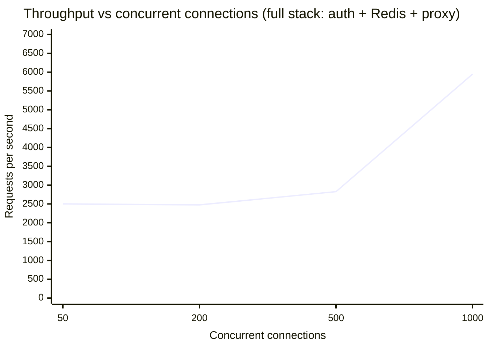
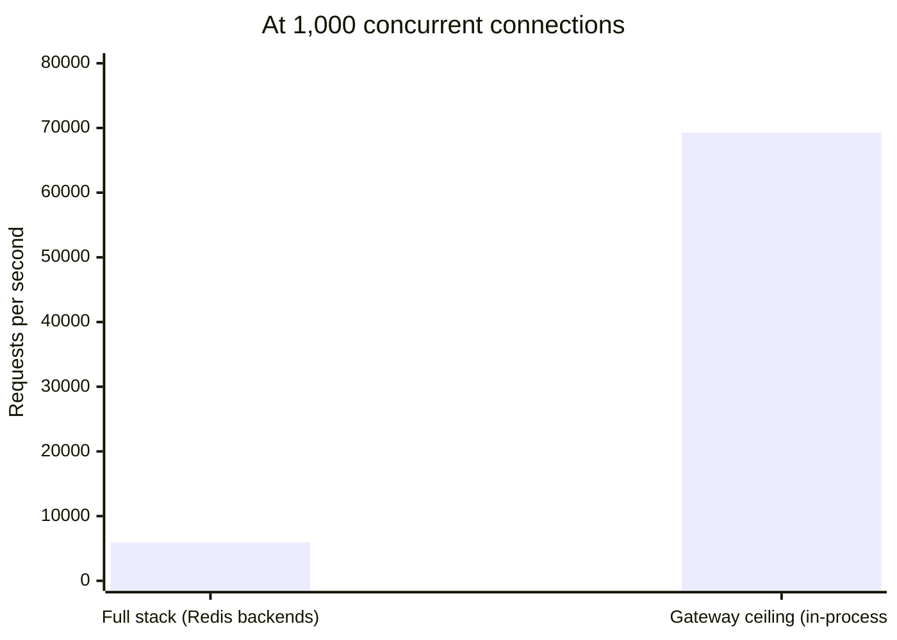
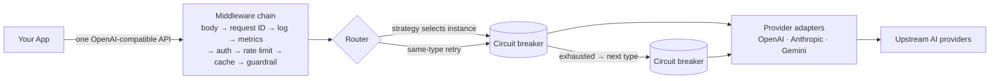
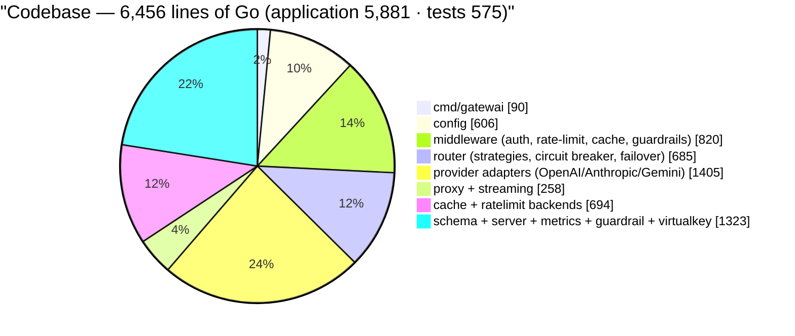

<p align="center">
  
  
  
  
  
</p>

<p align="center">
  <b>Gatewai</b> — a high-performance AI gateway. One OpenAI-compatible API for every LLM provider,
  with routing, failover, circuit breaking, rate limiting, caching, guardrails, and observability.
</p>

<p align="center">
  <b>10K–70K req/s</b> &nbsp;·&nbsp; <b>0.2–1ms</b> added latency &nbsp;·&nbsp; <b>~6.5K LOC</b> &nbsp;·&nbsp; <b>50–150MB RAM</b>
</p>

---

## Contents

- [What is Gatewai?](#what-is-gatewai)
- [Features](#features)
- [Performance](#performance)
- [Getting started](#getting-started)
- [Configuration](#configuration)
- [HTTP API](#http-api)
- [Architecture](#architecture)
- [Project structure](#project-structure)
- [Roadmap](#roadmap)
- [Contributing](#contributing)
- [License](#license)
- [Acknowledgements](#acknowledgements)

## What is Gatewai?

Gatewai is a reverse proxy that sits between your applications and AI providers
(OpenAI, Anthropic, Google Gemini), exposing a **single unified
OpenAI-compatible API**. Your app changes one line — the base URL — and Gatewai
handles what every LLM application eventually needs:

- **Resilience** — load balancing, retries with backoff, cross-provider failover, circuit breakers
- **Governance** — virtual API keys, per-model permissions, RPM/TPM rate limiting
- **Cost control** — response caching (exact-match + semantic) and per-token USD accounting
- **Safety** — pluggable content guardrails, evaluated before and after every request
- **Observability** — request IDs end-to-end, structured logs, Prometheus metrics

It is deliberately small (~6.5K lines of Go), fast, and dependency-light: the
core proxy runs with only the Go standard library plus Redis for shared state.
No database, no framework, no codegen.

## Features

| Area | What it does |
|---|---|
| **Unified API** | OpenAI-format `/v1/chat/completions` for every provider; per-provider request/response/SSE translation isolated in adapter packages |
| **Resilient routing** | Round-robin / weighted / least-latency strategies; same-type retries with exponential backoff + jitter (honoring `Retry-After`); **cross-provider failover** with `model_mapping`; per-instance **circuit breakers** with fail-fast and half-open recovery |
| **Governance** | Virtual keys with per-model allowlists; RPM/TPM rate limiting (in-memory or Redis, char-estimate token accounting); key material hashed before reaching Redis or metrics |
| **Caching** | Exact-match response cache (LRU, Redis or memory) with TTL; semantic cache over provider embeddings; cache invalidation on guardrail-blocked content |
| **Guardrails** | Pluggable classifiers — LLM-based, webhook, provider moderation — for pre-request and buffered post-response evaluation; streaming-safe |
| **Streaming** | Cross-provider SSE translation with chunk-by-chunk flushing, canonical `data: [DONE]` termination, and usage extraction from streams |
| **Observability** | Request IDs through every log line, structured `slog` output, Prometheus metrics with bounded cardinality, token **and USD cost** counters |
| **Operations** | Graceful shutdown, `/health` liveness, config-driven everything, env-var interpolation with fail-fast validation, multi-stage distroless Docker image |

## Performance

Measured on a Windows 11 (x64, 16-core) laptop with a 64-bit release build,
local mock upstreams, `hey` load tests and `go test -bench` microbenchmarks.
Full methodology at the bottom of this section.

### Throughput scaling — full stack under load

Every request exercises the entire hot path: auth → Redis rate-limit → Redis cache → router → upstream → response.



### Peak concurrency — full stack vs. gateway ceiling



### Hot-path microbenchmarks

| Hot path | Latency | Allocations | Memory |
|---|---:|---:|---:|
| One proxied request (auth + rate-limit + cache + route + relay) | **196.8 μs** | 135 | 7.2 KB |
| SSE chunk translation (Anthropic → OpenAI) | **4.1 μs** | 20 | 800 B |
| Cache lookup | **200 ns** | 1 | 11 B |
| Rate-limit check | **156 ns** | 0 | 0 B |

### Verified end-to-end with real providers

Live smoke tests against **OpenAI and Anthropic** returned real model responses
through the gateway, with Anthropic's response correctly translated to the
OpenAI schema. The gateway tracks its own spend in Prometheus: the entire
real-provider test run cost **$0.000003**.

### Methodology

All numbers above were produced on a Windows 11 (x64, 16-core) laptop using a
**64-bit release build** (`GOARCH=amd64`), local mock upstreams, the `hey` load
generator, and live OS/container sampling for CPU and RAM. Load-test waves ran
5–10s at 50–1,000 concurrent connections with **zero errors** at every level.
"Added latency" measures the gateway's own overhead — upstream LLM response
time (typically 1–10s) is excluded.

Reproduce with:

```bash
go test -bench=. -benchmem ./test/benchmark/
```

```bash
hey -z 10s -c 1000 -m POST \
  -H "Authorization: Bearer gw-test" \
  -D body.json \
  http://127.0.0.1:8080/v1/chat/completions
```

## Getting started

### Prerequisites

- Go 1.25+
- (optional) Redis 8+ for distributed rate limiting and caching — `docker run -d -p 6379:6379 redis:8`
- At least one API key from OpenAI, Anthropic, or Google Gemini

### Install

```bash
go install github.com/Jai-Keshav-Sharma/gatewai/cmd/gatewai@latest
```

or build from source:

```bash
git clone https://github.com/Jai-Keshav-Sharma/gatewai.git
cd gatewai
make build          # builds ./bin/gatewai
```

or run the container:

```bash
docker build -t gatewai .
docker run -d -p 8080:8080 gatewai
```

### Configure

```bash
cp configs/gatewai.example.yaml gatewai.yaml
export OPENAI_API_KEY_1="sk-..."
export ANTHROPIC_API_KEY="sk-ant-..."
export GEMINI_API_KEY="..."
```

Every option is documented inline in `configs/gatewai.example.yaml`. Missing
environment variables referenced by enabled features fail fast at startup —
Gatewai will never silently run with an empty key.

### Run

```bash
go run ./cmd/gatewai -config gatewai.yaml
```

Point your app at `http://localhost:8080/v1` — that's the whole migration:

```bash
curl http://localhost:8080/v1/chat/completions \
  -H "Content-Type: application/json" \
  -H "Authorization: Bearer gw-team-backend" \
  -d '{"model":"gpt-4o","messages":[{"role":"user","content":"Hello"}]}'
```

## Configuration

`configs/gatewai.example.yaml` is the single source of truth — every key is
documented inline. Highlights:

| Section | Purpose |
|---|---|
| `server` | bind address/port, read timeout, graceful-shutdown window (`write_timeout` must stay `0` for streaming) |
| `providers` | instances of `openai` / `anthropic` / `gemini` with `base_url`, `api_key` (`${ENV_VAR}` interpolation), `models`, `weight`, `max_retries`, `timeout` |
| `model_mapping` | cross-provider failover: request `gpt-4o`, fail over to `claude-sonnet` on the fallback type |
| `routing` | strategy (`round-robin` / `weighted` / `least-latency`), `fallback_order`, `circuit_breaker` |
| `rate_limiting` | global + per-key RPM/TPM, `memory` or `redis` backend, token estimation strategy |
| `cache` | exact-match + semantic response caching, `memory` or `redis` backend |
| `virtual_keys` | per-team keys with model allowlists and rate limits |
| `guardrails` | `llm` / `webhook` / `provider` classifiers, pre-request and post-response, streaming `buffer_mode` |
| `redis` | address, auth, pool sizing — only required if a backend uses Redis |
| `metrics` | Prometheus scrape endpoint and path |

## HTTP API

| Endpoint | Method | Auth | Purpose |
|---|---|---|---|
| `/v1/chat/completions` | POST | virtual key | Unified chat completions (non-streaming + SSE streaming) |
| `/v1/models` | GET | virtual key | List models across all configured providers |
| `/health` | GET | none | Liveness probe |
| `/metrics` | GET | none | Prometheus scrape endpoint |

## Architecture



Design principles:

- The request body is read **exactly once** (bodyparser); every downstream stage consumes a shared `RequestContext`
- **Stateless core** — shared state (rate limits, cache) lives in Redis, so the proxy scales horizontally
- **Streaming is sacred** — responses tee through the chain chunk-by-chunk with immediate flushes and per-provider translation, ending in the canonical `data: [DONE]`
- **Context is king** — every upstream call carries the client's context; a disconnected client cancels work and skips retries/failover

## Project structure



```
cmd/gatewai/          entry point: config → registry → routes → graceful shutdown
configs/              documented example configuration
internal/config/      YAML config, ${ENV_VAR} interpolation, fail-fast validation
internal/provider/    adapters: OpenAI, Anthropic, Gemini (+ streaming translation)
internal/router/      strategies, retries/backoff, cross-provider failover, circuit breakers
internal/middleware/  request ID, logging, metrics, auth, rate limit, cache, guardrails
internal/cache/       exact-match (memory/Redis) + semantic cache + embeddings
internal/ratelimit/   RPM/TPM limiters (memory/Redis)
internal/schema/      unified request/response types, SSE primitives, error envelopes
internal/server/      routes, Redis wiring, upstream transport, metrics endpoint
internal/metrics/     Prometheus collectors incl. USD cost accounting
internal/virtualkey/  virtual key store, hashing, model permissions
test/                 integration tests + hot-path benchmarks
```

## Roadmap

Ideas welcome — open an issue or PR:

- [ ] Semantic cache on Redis (Redis VSS) instead of in-memory brute force
- [ ] Accurate token counting (tiktoken-based TPM estimation)
- [ ] More provider adapters (Azure OpenAI, Mistral, xAI, DeepSeek, …)
- [ ] Kubernetes-ready: Helm chart, `sidecar` mode, cluster-wide config
- [ ] Admin/usage dashboard
- [ ] Reusable plugin/module system for guardrails and transforms

## Contributing

Contributions are welcome — bug reports, documentation, benchmarks, and
adapter ports all count. Please read [CONTRIBUTING.md](CONTRIBUTING.md) first.
It defines the project's three non-negotiables:

1. **Reliability** — correct behavior when things go wrong
2. **Scalability** — graceful degradation under growing load
3. **Maintainability** — clean interfaces, small functions, no duplication

Every PR must pass: `make lint`, `make test` (race detector), `make bench`
(no regressions), and a clean `govulncheck`.

## License

[MIT](LICENSE) © Jai Keshav Sharma

## Acknowledgements

- [prometheus/client_golang](https://github.com/prometheus/client_golang) — metrics
- [redis/go-redis](https://github.com/redis/go-redis) — Redis client
- The "one OpenAI-compatible API" pattern popularized by LiteLLM, Portkey, and Kong AI Gateway
- The Go standard library, for being enough to build most of a gateway with
